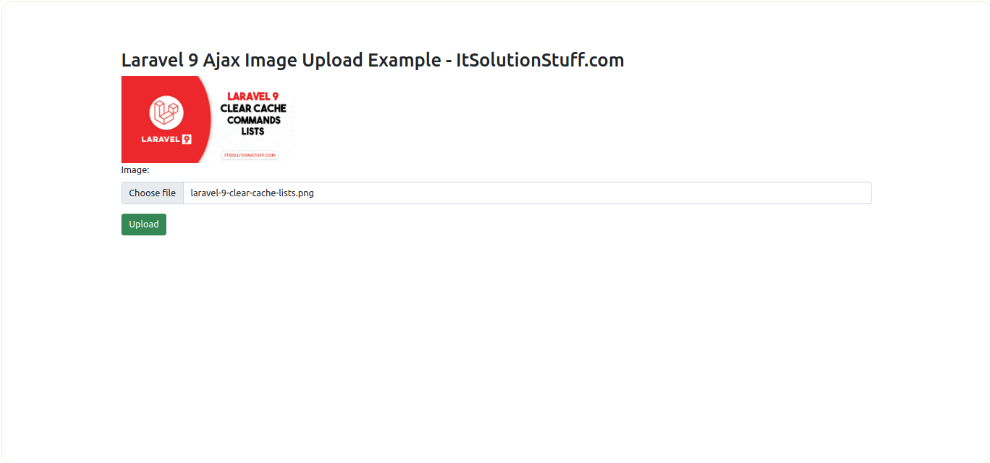

# laravel9_ajax_image_upload
## 1:Install Laravel 9:
```Dockerfile
composer create-project laravel/laravel laravel9_ajax_image_upload
```
## 2: Create Migration and Model
```Dockerfile
php artisan make:migration create_images_table
```
-  Vào database/migrations/2022_02_10_140040_create_images_table.php
```Dockerfile
<?php
  
use Illuminate\Database\Migrations\Migration;
use Illuminate\Database\Schema\Blueprint;
use Illuminate\Support\Facades\Schema;
  
return new class extends Migration
{
    /**
     * Run the migrations.
     *
     * @return void
     */
    public function up()
    {
        Schema::create('images', function (Blueprint $table) {
            $table->id();
            $table->string('name');
            $table->timestamps();
        });
    }
  
    /**
     * Reverse the migrations.
     *
     * @return void
     */
    public function down()
    {
        Schema::dropIfExists('images');
    }
};
```
- Chạy:
```Dockerfile
php artisan migrate
```
```Dockerfile
php artisan make:model Image
```
- Vào app/Models/Image.php
```Dockerfile
<?php
  
namespace App\Models;
  
use Illuminate\Database\Eloquent\Factories\HasFactory;
use Illuminate\Database\Eloquent\Model;
  
class Image extends Model
{
    use HasFactory;
  
    protected $fillable = [
        'name'
    ];
}
```
## 3: Create Controller
```Dockerfile
php artisan make:controller ImageController
```
- Vào app/Http/Controllers/ImageController.php
```Dockerfile
<?php
  
namespace App\Http\Controllers;
  
use Illuminate\Http\Request;
use App\Models\Image;
  
class ImageController extends Controller
{
    /**
     * Display a listing of the resource.
     *
     * @return \Illuminate\Http\Response
     */
    public function index()
    {
        return view('imageUpload');
    }
      
    /**
     * Display a listing of the resource.
     *
     * @return \Illuminate\Http\Response
     */
    public function store(Request $request)
    {
        $request->validate([
            'image' => 'required|image|mimes:jpeg,png,jpg,gif,svg|max:2048',
        ]);
        
        $imageName = time().'.'.$request->image->extension();  
         
        $request->image->move(public_path('images'), $imageName);
      
        Image::create(['name' => $imageName]);
        
        return response()->json('Image uploaded successfully');
    }
}
```
- Store Images in Storage Folder
```Dockerfile
$image->storeAs('images', $imageName);
// storage/app/images/file.png
```
- Store Images in Public Folder
```Dockerfile
$image->move(public_path('images'), $imageName);
// public/images/file.png
```
- Store Images in S3
```Dockerfile
$image->storeAs('images', $imageName, 's3');
```
## 4: Create and Add Routes
- Vào routes/web.php
```Dockerfile
<?php
  
use Illuminate\Support\Facades\Route;
  
use App\Http\Controllers\ImageController;
  
/* 
|--------------------------------------------------------------------------
| Web Routes
|--------------------------------------------------------------------------
|
| Here is where you can register web routes for your application. These
| routes are loaded by the RouteServiceProvider within a group which
| contains the "web" middleware group. Now create something great!
|
*/
  
Route::controller(ImageController::class)->group(function(){
    Route::get('image-upload', 'index');
    Route::post('image-upload', 'store')->name('image.store');
});
```
## 5: Create Blade File
- Vào resources/views/imageUpload.blade.php
```Dockerfile
<!DOCTYPE html>
<html>
<head>
    <title>Laravel 9 Ajax Image Upload Example - ItSolutionStuff.com</title>
    <link href="https://cdn.jsdelivr.net/npm/bootstrap@5.0.2/dist/css/bootstrap.min.css" rel="stylesheet">
    <script src="https://cdnjs.cloudflare.com/ajax/libs/jquery/3.6.0/jquery.min.js" integrity="sha512-894YE6QWD5I59HgZOGReFYm4dnWc1Qt5NtvYSaNcOP+u1T9qYdvdihz0PPSiiqn/+/3e7Jo4EaG7TubfWGUrMQ==" crossorigin="anonymous" referrerpolicy="no-referrer"></script>
</head>
       
<body>
<div class="container">
         
    <div class="panel panel-primary">
    
      <div class="panel-heading">
        <h2>Laravel 9 Ajax Image Upload Example - ItSolutionStuff.com</h2>
      </div>
   
      <div class="panel-body">
         
        
       
        <form action="{{ route('image.store') }}" method="POST" id="image-upload" enctype="multipart/form-data">
            @csrf
    
            <div class="mb-3">
                <label class="form-label" for="inputImage">Image:</label>
                <input 
                    type="file" 
                    name="image" 
                    id="inputImage"
                    class="form-control">
                <span class="text-danger" id="image-input-error"></span>
            </div>
     
            <div class="mb-3">
                <button type="submit" class="btn btn-success">Upload</button>
            </div>
        
        </form>
        
      </div>
    </div>
</div>
</body>
  
<script type="text/javascript">
    $.ajaxSetup({
        headers: {
            'X-CSRF-TOKEN': $('meta[name="csrf-token"]').attr('content')
        }
    });
  
    $('#inputImage').change(function(){    
        let reader = new FileReader();
   
        reader.onload = (e) => { 
            $('#preview-image').attr('src', e.target.result); 
        }   
  
        reader.readAsDataURL(this.files[0]); 
     
    });
  
    $('#image-upload').submit(function(e) {
           e.preventDefault();
           let formData = new FormData(this);
           $('#image-input-error').text('');
  
           $.ajax({
              type:'POST',
              url: "{{ route('image.store') }}",
               data: formData,
               contentType: false,
               processData: false,
               success: (response) => {
                 if (response) {
                   this.reset();
                   alert('Image has been uploaded successfully');
                 }
               },
               error: function(response){
                    $('#image-input-error').text(response.responseJSON.message);
               }
           });
    });
      
</script>
      
</html>
```
## 6: Run Laravel App:
```Dockerfile
php artisan serve
```
http://localhost:8000/image-upload



